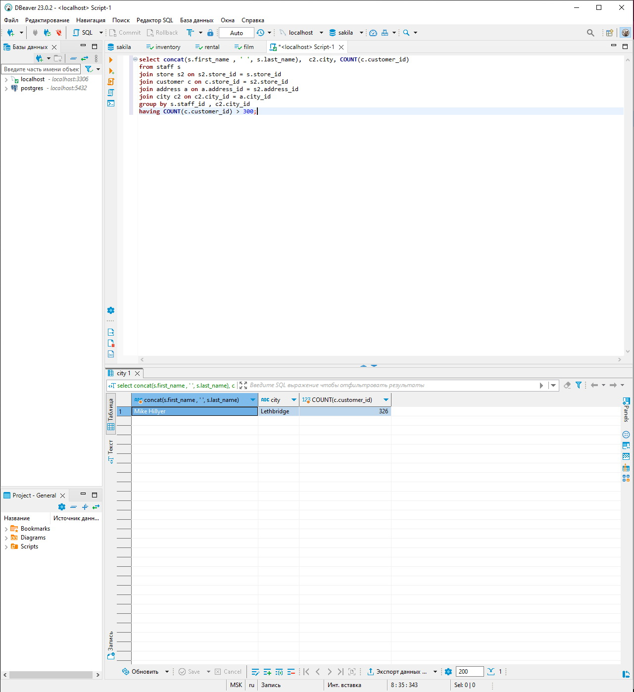
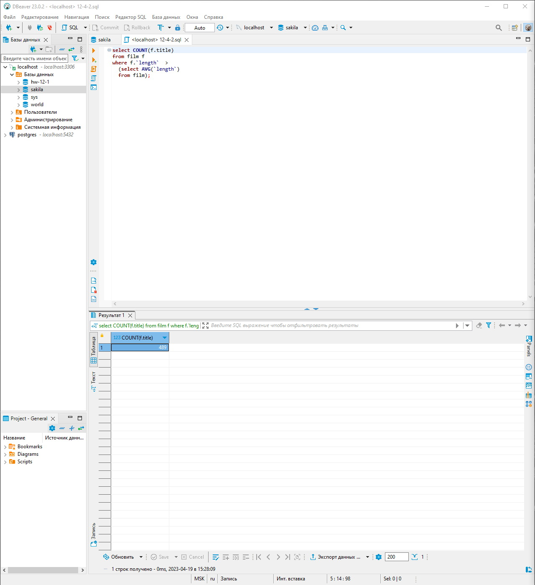
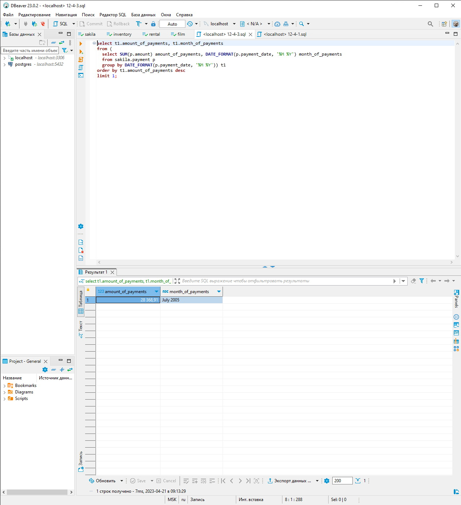

# Домашнее задание к занятию «SQL. Часть 2» - `Горбачев Олег`

---

Задание можно выполнить как в любом IDE, так и в командной строке.

### Задание 1

Одним запросом получите информацию о магазине, в котором обслуживается более 300 покупателей, и выведите в результат следующую информацию: 
- фамилия и имя сотрудника из этого магазина;
- город нахождения магазина;
- количество пользователей, закреплённых в этом магазине.
- 
### Решение 1
```sql
select concat(s.first_name , ' ', s.last_name),  c2.city, COUNT(c.customer_id) 
from staff s
join store s2 on s2.store_id = s.store_id 
join customer c on c.store_id = s2.store_id
join address a on a.address_id = s2.address_id 
join city c2 on c2.city_id = a.city_id 
group by s.staff_id, c2.city_id 
having COUNT(c.customer_id) > 300;
```


---

### Задание 2

Получите количество фильмов, продолжительность которых больше средней продолжительности всех фильмов.
### Решение 2
```sql
select COUNT(f.title)
from film f  
where f.`length`  >
  (select AVG(`length`) 
  from film);   
```


---

### Задание 3

Получите информацию, за какой месяц была получена наибольшая сумма платежей, и добавьте информацию по количеству аренд за этот месяц.
### Решение 3
```sql
select t1.amount_of_payments, t1.month_of_payments
from (
  select SUM(p.amount) amount_of_payments, DATE_FORMAT(p.payment_date, '%M %Y') month_of_payments 
  from sakila.payment p 
  group by DATE_FORMAT(p.payment_date, '%M %Y')) t1
order by t1.amount_of_payments desc  
limit 1;
```


---
